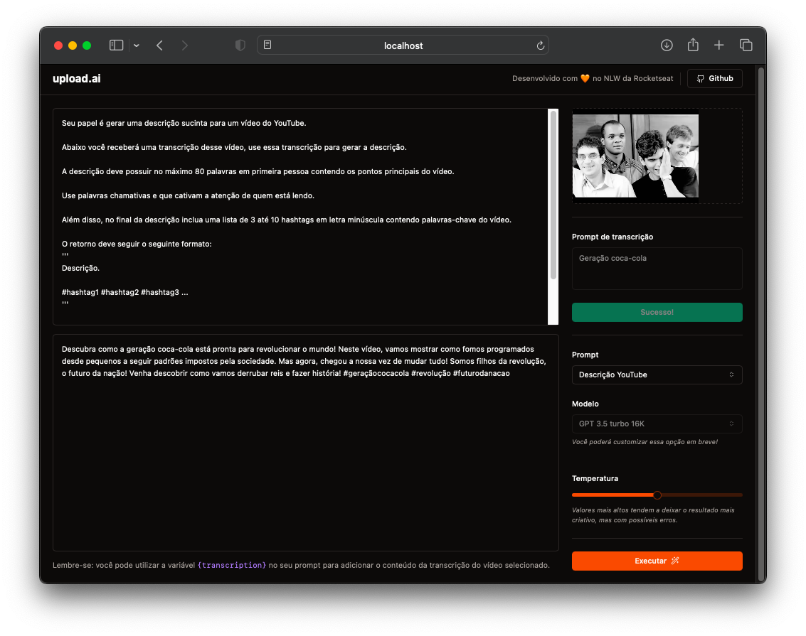

# nlw-AI

## 🚀 Projeto
Aplicação que possibilita realizar upload de videos e por meio de IA, criar automaticamente títulos chamativos e descrições com um boa indexação.

Projeto desenvolvido durante a Next Level Week, realizada pela [@Rocketseat](https://www.rocketseat.com.br) em set/23.

<div align="center">
  
</div>

## 🛠️ Tecnologias
- 🖼️ Frontend: [React](https://pt-br.reactjs.org) | [Tailwind CSS](https://tailwindcss.com)
- 📊 Backend: [Node.js](https://nodejs.org/en/) | [Prisma](https://www.prisma.io) | [OpenAI](https://openai.com/product)

## 🗂️ Utilização

### 🐑🐑 Clonando o repositório:

```bash
  $ git clone url-do-projeto.git
```

### 🔑 Configurando a API OpenAI:
- [Crie uma chave de API da OpenAI](https://platform.openai.com/account/api-keys)
- Adicione a chave de API ao seu arquivo <code>.env</code>, de acordo com o arquivo <code>.env.example</code>

### ▶️ Rodando o App:

🖼️ Frontend
```bash
  $ cd front                #change to this directory
  $ npm install             #download dependencies to node_modules
  $ npm run dev             #start the project
```

📊 Backend
```bash
  $ cd back                 #change to this directory
  $ npm install             #download dependencies to node_modules
  $ npx prisma migrate dev  #creates the local dev.db file
  $ npx prisma db seed      #populates the db with data from the seed.ts file
  $ npx prisma studio       #db management thru a control panel in a web browser tab
  $ npm run dev             #start the project

  #Rotas:
  - Lista os prompts disponíveis:
  GET http://localhost:4000/prompts

  - Envia um áudio mp3 (extraído do vídeo mp4) para o servidor:
  POST http://localhost:4000/videos
  Body: Multipart form: “file”: YOUR_FILE.mp3

  - Transcreve o áudio de um video da db:
  http://localhost:4000/videos/YOUR_FILE_ID/transcription
  Body: JSON: {"prompt": "palavra-chave 1, palavra-chave 2, frase 1, frase 2, ..."}

  - Usa IA para gerar um conteúdo, baseado no prompt, de um vídeo da db:
  POST http://localhost:4000/ai/generate
  Body: JSON:
  {
    "videoId": "YOUR_FILE_ID",
    "temperature": 0.5,
    "prompt": "Gere um resumo da transcrição do vídeo informada a seguir: '''{transcription}'''"
  }
```